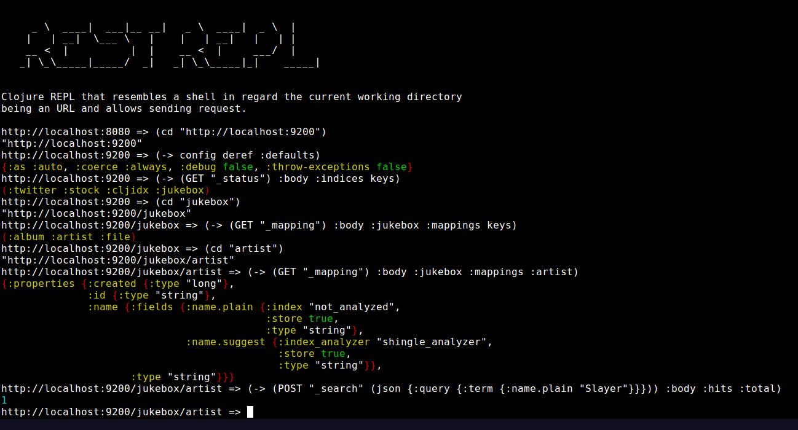

Deprecation and replacement
===========================

All features and more (easy configuration, plugin structure to add
rebel-readline, pomegranate, ...), ...) now present in
[`wrepl`](https://github.com/christoph-frick/clj-wrepl/blob/master/doc/rest-repl.md)

      
      _ \  ____|  ___|__ __|   _ \  ____|  _ \  |     
     |   | __|  \___ \   |    |   | __|   |   | |     
     __ <  |          |  |    __ <  |     ___/  |     
    _| \_\_____|_____/  _|   _| \_\_____|_|    _____| 


Clojure REPL that resembles a shell in regard the current working
directory being an URL and allows sending request.


Why
===

While tools like `httpie` are nice to query some APIs with some nice
syntax and getting back some formatted JSON and even some colors, those
are not ideal to interact with the API.  It comes down to interact with
the shell and do call after call and copy down values from your results
in your next request.  Complex interactions are usually out of
questions.


Building and running
====================

You need to have [Leiningen`(https://leiningen.org/) installed.  Check
out this repo and run `lein uberjar`.  Once finished there will be a
`target/rest-repl-$VERSION-standalone.jar` 
which can be run with 
`java -jar target/rest-repl-$VERSION-standalone.jar` 

Ideally it gets started with `rlwrap` (this is a full blown example):

    rlwrap -m -M .clj -C rest-repl -H "`pwd`/.rest-repl_history" java -jar target/rest-repl-*-standalone.jar

(needs `rlwrap` to be installed: the parameters there let edit the
current line with `CTRL-^` and keeps it's own history file for each
project directory;  make that an `alias` in your shell)


Usage
=====


Startup and REPL prompt
-----------------------

Command line parameters:

    rest-repl [options...] [url]
    
      -i, --init script.clj  Run the given file before the first prompt
      -e, --eval string      Evaluate the expression (after --init if both given)
      -h, --help

On the prompt call `(help)` for the functions available (also
[here](resources/help.md))

To show off the color output and formatting by `puget`, here is a
screenshot what it looks like:




By default once started the default URL is `http://localhost:8080` which
results in the prompt:

```
http://localhost:8080 => _
```

(`_` marks the cursor)

This prompt shows the current URL and prompts for Clojure code as user
input.  So any Clojure code works here:

```
http://localhost:8080 => (+ 1 2 3)
6
```


State: default request parameters
---------------------------------

The URL and the setup for `clj-http` are held in an atom that can be
reviewed with `@config`:

```
http://localhost:8080 => @config
{:base-url "http://localhost:8080",
 :request {:as :auto, :coerce :always, :debug false, :throw-exceptions false}}
```

`:base-url` is the URL the application started at.  `:request` holds a map,
that is used for each request to be merged with the user input.  The
available options are documented in the 
[`clj-http` README](https://github.com/dakrone/clj-http/blob/master/README.org).

The default request `:request` on startup is chosen to allow for some smooth
usage for the standard use cases.  They can be changed with the `default`
function.  It takes keys as varargs and finally the value to set it.
E.g.

```
http://localhost:8080 => (default :debug true)
{:base-url "http://localhost:8080",
 :request {:as :auto, :coerce :always, :debug true, :throw-exceptions false}}
http://localhost:8080 => (default :headers "X-Auth-Token" "XYZ")
{:base-url "http://localhost:8080",
 :request {:as :auto,
            :coerce :always,
            :debug true,
            :headers {"X-Auth-Token" "XYZ"},
            :throw-exceptions false}}
```


State: navigation on the URL
----------------------------

To change the URL, there is the `cd` function, that behaves similar to
the same command of a shell.  This behaves relative to the path, the
prompt shows.  So a simple string goes down one level.  Using `..` goes
up.  If the path starts with a `~`, the base URL is used.  If two
parameters are passed, the first parameter gets replaced in the current
path with the second parameter.  E.g.

```
http://localhost:8080 => (cd "user")
"http://localhost:8080/user"
http://localhost:8080/user => (cd "role")
"http://localhost:8080/user/role"
http://localhost:8080/user/role => (cd "~/group/role")
"http://localhost:8080/group/role"
http://localhost:8080/group/role => (cd "..")
"http://localhost:8080/group/"
http://localhost:8080/group/ => (cd "group" "user")
"http://localhost:8080/user/"
```

Note, that changing the URL does not call that URL or ensures in any
way, that this is a valid endpoint.


Sending requests
----------------

Requests are sent by default to the current URL with the `request`
function.  It takes the HTTP verb as keyword as first parameter.  The
next one is an optional absolute or relative path, that gets used like
when used with `cd`, but only for that request.  Finally a map get's
passed, that is the request as defined in 
[`clj-http`](https://github.com/dakrone/clj-http/blob/master/README.org).

There are shortcut functions for `GET`, `POST`, `PUT`, `DELETE` (so `(GET ...)`
is the shortcut for `(request :get ...)`.

```
https://google.com => (GET {})
{:body "<!doctype html>...",
 :chunked? true,
 :content-type :text/html,
 :content-type-params {:charset "ISO-8859-1"},
 :cookies {...},
 :headers {...},
 :length -1,
 :orig-content-encoding nil,
 :protocol-version {:major 1, :minor 1, :name "HTTP"},
 :reason-phrase "OK",
 :repeatable? false,
 :request-time 794,
 :status 200,
 :streaming? true,
 :trace-redirects ["https://google.com"]}
```

Common values for the map contain `:query-params` for `GET` or
`:form-params` for `POST` for more web style requests.

More likely in an API calling scenario, JSON or XML bodies are sent and
received.  So there are helper functions to build a body common for
those kind of services: `json` and `xml`.

`json` just takes a map, that get's converted to JSON via `cheshire`.
E.g.:

```
http://localhost:9200/jukebox/artist => (json {"test" 1})
{:body "{\"test\":1}", :content-type :json}
http://localhost:9200/jukebox/artist => (:body (POST "_search" (json {:query {:term {:name.plain "Slayer"}}})))
{:_shards {:failed 0, :successful 1, :total 1},
 :hits {:hits [{:_id "Slayer",
                :_index "jukebox",
                :_score 11.390072,
                :_source {:created 1411731380102, :id "Slayer", :name "Slayer"},
                :_type "artist"}],
        :max_score 11.390072,
        :total 1},
 :timed_out false,
 :took 9}
```

`xml` takes a vector with a tag, optional attributes, and optional
childs (like the popular format of `hiccup`).  E.g.

```
http://localhost:8080 => (xml [:root {"attr" "attr-value"} "content"])
{:body "<?xml version=\"1.0\" encoding=\"UTF-8\"?><root attr=\"attr-value\">content</root>",
 :content-type :xml}
```


Example usage
=============

This is a short real life example, how I use `rest-repl` in a project.

Usually there is some `rest-repl.clj` or more than one for different
development environments.  The file contains regular Clojure code to
bootstrap REPL with the `-i` parameter like: `rest-repl -i rest-repl.clj`.
It might look something like this:

```clojure
(def login-url "http://localhost:8080/api/1.0/login")
(def login-cred {:username "username" :password "password"})

(defn login 
  [] 
  (let [token (-> (request :post login-url (json login-cred)) :body :access_token)] 
    (default :headers "X-Auth-Token" token)))

(cd "/api/1.0")
(login)
```

There might be further functions or some requires like for
`clojure.inspector` or a `(load-file "some-common-tools.clj")` or ...
After all it's just Clojure code.

From that that I can now explore the API by sending requests,
`def` interesting results, work with all the other great Clojure data
manipulation functions, debug larger results with
`clojure.inspector`'s `tree-view`, etc.  Repetitive tasks become
functions, that will be added to my bootstrap file.


Further Examples
================

[How to use the REST-REPL for generative testing with `clojure.spec`](doc/testing.md)


Libraries used by this project
==============================

Shout out to all the great software, that made this possible:

- [clj-http](https://github.com/dakrone/clj-http) to handle HTTP
- [cheshire](https://github.com/dakrone/cheshire) to handle JSON
- [data.xml](https://github.com/clojure/data.xml) to handle XML
- [specter](https://github.com/nathanmarz/specter) injected
  automatically to handle nested data
- [puget](https://github.com/greglook/puget) for colored output

